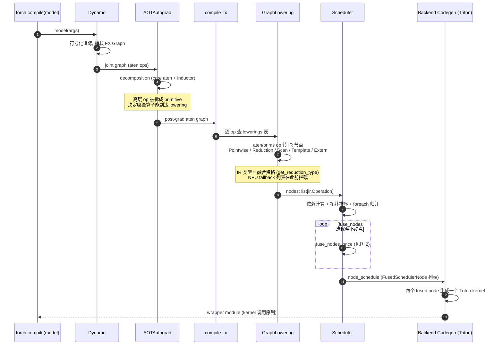
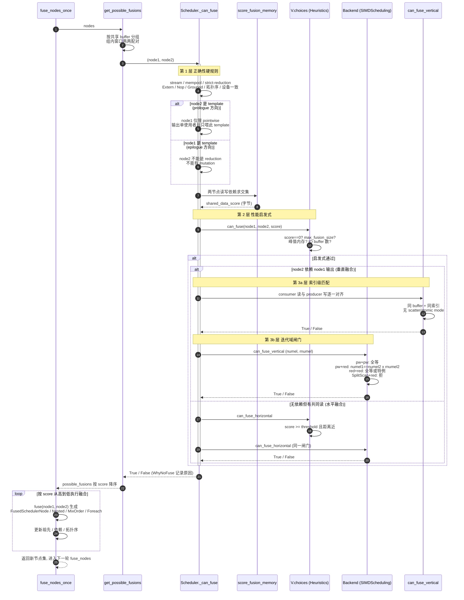

# torchinductor 算子融合广度分析(GPU vs NPU)

> 统一口径量化 GPU(PyTorch 官方 inductor)与 NPU(torch_npu)在算子融合参与广度上的差距。
> 分析基于 `torch/_inductor/`(PyTorch 主仓)与 `torch_npu/_inductor/lowering_fallback_list.py`(torch_npu)。

---

## 目录

- [0. TL;DR](#0-tldr)
- [1. 核心机制:融合能力由谁决定](#1-核心机制融合能力由谁决定)
- [2. GPU(PyTorch 官方)融合分析](#2-gpupytorch-官方融合分析)
- [3. NPU(torch_npu)fallback 分析](#3-nputorch_npufallback-分析)
- [4. 统一口径:如何正确对比](#4-统一口径如何正确对比)
- [5. 实测结果](#5-实测结果)
- [6. 指标的边界:能反映什么 / 不能反映什么](#6-指标的边界能反映什么--不能反映什么)
- [7. 可复现方法](#7-可复现方法)
- [8. 结论与可操作建议](#8-结论与可操作建议)
- [9. 实战例子:100 op 图怎么压成几个 kernel](#9-实战例子100-op-图怎么压成几个-kernel)
- [10. 融合 kernel 含的算子数上限](#10-融合-kernel-含的算子数上限)

---

## 0. TL;DR

- **融合能力不是在 lowering 阶段直接判定的**:lowering 把算子翻成 IR 节点,**IR 类型**决定融合性,scheduler 的 `can_fuse` 真正拍板。
- NPU 的 `NPU_EXTRA_FALLBACK_LIST` 写着 592 条,但**这是 (op, overload) 条目数,不是算子数**:去重后只有 **221 个概念算子**。
- **decomposition 口径实测**(到达 lowering 的真实算子集):GPU 可融合 **173** 个、NPU 可融合 **87** 个、静态差距 **86** 个(覆盖率 50.3%)。其中 **34 个 prims 经源码静态证明为惰性**(图里永不出现),**运行时相关真实差距 52 个**(活跃 aten 口径覆盖率 55.2%)。详见 §5.4-5.7。
- ⚠️ **关键纠正**:decomposition **不提高覆盖率**。它把 739 个被分解的高层 op 路由到 ~173 个可融合 primitive,但可融合 primitive 集本身固定,损失(`prims.exp`/`aten.erf`/`acos` 等)**不因分解而消失**。
- **fallback ≠ 慢**:NPU 把这些算子交给 AclNN 厂商库 kernel,后者本身可能是融合的。此指标只量"融合参与广度",不量"性能"。

---

## 1. 核心机制:融合能力由谁决定

两个阶段共同决定:

1. **Lowering 阶段**(`torch/_inductor/lowering.py`):ATen/Prim 算子 → IR 节点。算子产生什么 IR 类型,就具备什么融合性。
2. **Scheduler 阶段**(`torch/_inductor/scheduler.py` `can_fuse`):基于 IR 类型 + 共享数据评分 + 拓扑关系,决定哪些节点融进同一个 kernel。

此外,**decomposition** 在到达 lowering 之前先把大量复杂 ATen 算子拆成可融合的 primitive:

- core aten decompositions:177 个
- inductor decomposition:50 个

因此可融合的算子面远大于 lowering.py 里显式注册的数量。

### IR 节点类型与 fusibility(`torch/_inductor/ir.py`)

| IR 类 | 行号 | `get_reduction_type()` | 融合性 |
|---|---|---|---|
| `Pointwise(Loops)` | 1214 | `None` | ✅ 任意融合 |
| `Scatter(Pointwise)` | 1255 | `None`(带 mode) | ⚠️ 带 scatter/atomic mode 时不可融 |
| `Reduction(Loops)` | 1379 | `"sum"/"max"/...` | ✅ 与 Pointwise epilogue/prologue 融合 |
| `ArgReduction` | 2345 | `"argmax"/"argmin"` | ✅ 同上 |
| `WelfordReduction` | 2640 | `"welford_*"` | ✅ mean/var |
| `Scan(Loops)` | 2872 | `"custom"` | ✅ 自融,但**不可与 Reduction 融合** |
| `Sort(Loops)` | 3086 | `"sort"` | ⚠️ 伪装 reduction,边界多 |
| `TemplateBuffer` | 5871 | — | ⚠️ 仅 epilogue/prologue/multi-out 三路径 |
| `ExternKernel` | 6990 | — | ❌ 基本不可融(除 `UserDefinedTritonKernel` epilogue) |
| `NopKernel`/`ConcatKernel` | 6727/6735 | — | ❌ 不可作 producer |

### 1.1 融合裁决的完整调用链:四层漏斗

一个融合决策不是单点判断,而是**四层漏斗逐层收紧,全部通过才真正 `fuse()`**:

```
候选对 (node1, node2)
  │
  ├─ 第 0 层: IR 类型资格 (lowering 时静态决定, 不可逆)
  │    get_reduction_type() → None / "sum" / "custom" / "sort" / template / extern
  │
  ├─ 第 1 层: Scheduler._can_fuse ── 正确性硬规则 (scheduler.py:8680)
  │
  ├─ 第 2 层: V.choices ── 性能启发式 (choices.py:628)
  │
  └─ 第 3 层: Backend 闸门 ── numel/rnumel 迭代域匹配 (codegen/simd.py:2285)
```

> 行号基于 2026-08-20 main 快照,会随代码演进漂移;长期引用请记函数名
> (`Scheduler._can_fuse` / `Choices.can_fuse` / `SIMDScheduling.can_fuse`)。
> IR 类型即"融合身份":**lowering 决定出身,scheduler 决定婚配**。

### 1.2 第 1 层:Scheduler 硬规则(正确性,按序短路)

`torch/_inductor/scheduler.py:8680` 的 `_can_fuse`,任一失败即拒:

| # | 规则 | 位置 |
|---|---|---|
| 1 | 同节点 / 跨 stream / 跨 mempool 拒 | 8688, 8697-8706 |
| 2 | `FusedNestedReductions`/`FusedMixOrderReductions` 改道各自 `can_fuse_with` | 8708-8718 |
| 3 | strict reduction 排斥:template x strict-reduction 拒;red x red 任一 strict 拒 | 8722-8732 |
| 4 | `GroupedSchedulerNode` / `NopKernelSchedulerNode` 不可融 | 8743-8750 |
| 5 | Extern 唯一活路:`UserDefinedTritonKernel` epilogue,且必须是"对该 kernel 唯一 mutation 输出的 unary pointwise、读写同索引、布局同构" | 8752-8839 |
| 6 | node2 是 Extern/Nop(非 template)不可作 consumer | 8841-8846 |
| 7 | 拓扑序(node2 祖先不能含 node1 输出);`will_fusion_create_cycle` 防 fusion 间接成环 | 8848, 7550 |
| 8 | Template prologue(node2 是 template):node1 仅限 pointwise、无 alias/mutation、输出单使用者且只喂此 template | 8852-8912 |
| 9 | Template epilogue(node1 是 template):consumer 不能有 mutation(atomic_add 例外)、不能是 reduction(目前仅 NVGEMM backend 开放) | 8914-8936 |
| 10 | `no_fuse_buffer_names` 显式禁融;设备必须一致 | 8938-8947 |

### 1.3 第 2 层:V.choices 启发式(性能,非正确性)

`torch/_inductor/choices.py:628` `can_fuse` + 698/708:

- `shared_data_score == 0` 拒("no shared data";除非 `aggressive_fusion` 且双方都不是 reduction)
- 融合后节点数 > `max_fusion_size` 拒;推高峰值内存拒;IO buffer 数超 `max_fusion_unique_io_buffers` 拒
- 水平融合额外要求:得分 ≥ `score_fusion_memory_threshold` 且两节点调度距离不远(choices.py:719-726)

`shared_data_score` 来自 `score_fusion_memory`(scheduler.py:9475):**两节点读写依赖集合的交集大小(按字节计)**。pointwise 链上 producer 的写恰好是 consumer 的读,交集非零、得分高。

### 1.4 第 3 层:Backend(Triton)迭代域闸门

`SIMDScheduling.can_fuse`(codegen/simd.py:2285),并被别名为
`can_fuse_vertical = can_fuse_horizontal = can_fuse`(simd.py:2494)。核心是
`(numel, rnumel)` 匹配:`numel` 为迭代域元素数,`rnumel` 为归约维长度。

| 组合 | 规则 | 代码 |
|---|---|---|
| SplitScan x Reduction | 直接拒("Split scan cannot fuse with reductions") | simd.py:2300-2307 |
| Reduction + Reduction | `(numel, rnumel)` **完全相等**;不等时仅两条特例活路:MixOrderReduction(行列序互逆的兄弟归约, scheduler.py:335)/ NestedReduction(依赖嵌套归约) | simd.py:2309-2373 |
| Pointwise + Pointwise | `(numel, rnumel)` 相等(prologue 例外:与已有 prologue 节点同 group 即可);template 直接放行;否则查 tiling 兼容 | simd.py:2375-2436 |
| Pointwise + Reduction(prologue) | `rnumel1==1` 且 `numel1 == numel2 * rnumel2`(pointwise 展开进归约的迭代域) | simd.py:2438-2467 |
| Reduction + Pointwise(epilogue) | swap 参数后走 horizontal 分支,要求 `numel1 == numel2` | simd.py:2481 |

### 1.5 索引级匹配与 scatter 屏障

`can_fuse_vertical`(scheduler.py:9043):consumer 的每个未满足读依赖,要么与
producer 的写在"**同 buffer + 同索引表达式 + 大小前缀匹配**"意义下精确对上,要么由
可先行调度的节点提供;中间夹着别的节点即拒("intermediate nodes between node1 &
node2", 9107-9112)。

关键拒绝点在 `fusable_read_and_write`(scheduler.py:9215):

```python
if self.mode_requires_synchronization(original_write.mode):
    return False
```

`mode_requires_synchronization`(scheduler.py:5573)就是 `mode is not None`——**一切带
scatter/atomic store mode 的写一律不可作为融合对象**。Scatter/Index 家族是 fusion
barrier 的准确机制是"写模式需全线程同步",**不是算子名单黑名单**;未来新增的
atomic 类算子会自动落入同一屏障,无需登记名单。

### 1.6 Foreach 特例

`ForeachKernelSchedulerNode.can_fuse`(scheduler.py:3661):

- foreach x foreach:**长度相等 + 逐对子节点可融**
- foreach x reduction:**双向都拒**(3673-3693)
- foreach x 普通:找到唯一配对 subnode 后退化为普通融合

### 1.7 融合时序图

> GitHub 与 VSCode(Markdown Preview Mermaid 插件)可直接渲染。

#### 图 1:编译总流水线(融合发生在哪一步)



#### 图 2:fuse_nodes_once 内部的四层裁决时序(核心)



---

## 2. GPU(PyTorch 官方)融合分析

`torch/_inductor/lowering.py` 内显式注册约 **360 个 lowering 点**。按产生的 IR 类型分类:

### 2.1 可融合算子(主体)

| 类别 | 数量(估) | 产生 IR | 代表算子 |
|---|---|---|---|
| **Pointwise 逐元素** | ~180 | `Pointwise` | `add/mul/div/pow`, `relu/sigmoid/tanh/exp/sqrt/log/erf`, `sin/cos/atan`, `bitwise_*/logical_*`, `where/clamp/maximum/minimum`, `le/lt/ge/gt/eq/ne`, `torch.special.*`(41 个) |
| **Reduction 归约** | ~24 | `Reduction`/`ArgReduction` | `sum/prod/mean/var/std`, `amax/amin/max/min`, `argmax/argmin`, `any/xor_sum` |
| **View/Shape/视图** | ~50 | `*View`/`Alloc` | `view/reshape/permute/slice/expand/squeeze`, `cat/split/unbind`, `empty/arange/full/clone`, `alias/detach` |
| **Scan 前缀和** | 5 | `Scan` | `cumsum/cumprod/cummax/cummin/logcumsumexp` |
| **Template(mm/conv)** | ~27 | `TemplateBuffer` | `mm/bmm/addmm/_int_mm/_scaled_mm`, `convolution`, `mkldnn._*_pointwise`, `flex_gemm_hop` |

### 2.2 不可融合算子(fusion barrier)

| 类别 | 数量(估) | 原因 |
|---|---|---|
| **Scatter/Index 家族** | ~30 | 带 scatter mode 需同步写:`scatter(_add)(_reduce)`, `index_put(_)`, `gather`, `embedding`, `as_strided_scatter` |
| **Sort/Topk/Search** | ~8 | 全局排序语义:`sort`, `topk`, `kthvalue`, `median`, `mode`, `searchsorted`, `bucketize` |
| **Extern/Fallback(pool/upsample)** | ~30+ | `is_extern=True`:`max_pool*_with_indices`, `avg_pool*`, `adaptive_*_pool`, `upsample_nearest*`, 及未注册 op 自动 fallback |
| **Reduction+Reduction 异 shape** | — | 仅同 shape / mix-order / nested 特殊路径可融 |
| **SplitScan + Reduction** | — | `simd.py:2300-2307` 显式拒绝(2026-08 快照;早期为 2077) |

### 2.3 融合组合矩阵(含裁决代码依据)

| Producer → Consumer | 可融? | 条件 | 裁决位置(2026-08 快照) |
|---|---|---|---|
| Pointwise + Pointwise | ✅ | 同 `(numel, rnumel=1)` | `simd.py:2375-2385` + choices 共享数据分 |
| Pointwise + Reduction | ✅ | prologue | `simd.py:2438-2449`(`numel1 == numel2*rnumel2`) |
| Reduction + Pointwise | ✅ | epilogue(读归约结果) | `simd.py:2481` swap 后 `numel1 == numel2` |
| Reduction + Reduction(同 shape) | ✅ | 兄弟归约 | `simd.py:2310` 全等;特例 mix-order(`scheduler.py:335`)/nested |
| Template + Pointwise | ✅ | matmul/conv epilogue | `scheduler.py:8914-8936` |
| Pointwise + Template | ✅ | prologue fusion | `scheduler.py:8852-8912` + `simd.py:2387-2406` |
| Foreach + Foreach | ✅ | 子节点逐对可融 | `scheduler.py:3663-3672`(需长度相等) |
| SplitScan + Reduction | ❌ | 显式拒绝 | `simd.py:2300-2307`(早期快照为 2077) |
| Foreach + Reduction | ❌ | 双向拒绝 | `scheduler.py:3673-3693`(早期快照为 3256) |
| Reduction + Template prologue/epilogue | ❌ | consumer 不能是 reduction | prologue:`scheduler.py:8857-8859`;epilogue:`scheduler.py:8922-8924`(仅 NVGEMM 开放) |
| 带 scatter/atomic mode 的 op + 读取 | ❌ | 需同步写 | `scheduler.py:9215` + `5573`(`mode is not None` 即拒) |

> Scatter 拒绝不是名单制而是**模式制**:任何 store mode 非 None 的写(scatter_add/atomic/TMA)一律因"需全线程同步"被拒,新增 atomic 类算子自动落入同一屏障(机制详见 §1.5)。

---

## 3. NPU(torch_npu)fallback 分析

### 3.1 fallback 列表的三段结构

文件 `torch_npu/_inductor/lowering_fallback_list.py`:

```python
TORCH_NATIVE_FALLBACK_LIST = [...]   # 340 条:GPU/CPU 原生也会 fallback 的算子(两边都不融合)
NPU_EXTRA_FALLBACK_LIST   = [...]   # 592 条:NPU 额外 fallback(= 相对 GPU 的损失)
FALLBACK_LIST = TORCH_NATIVE_FALLBACK_LIST + NPU_EXTRA_FALLBACK_LIST
```

文件头注释明确:"After fixed and verified, it can be removed from FALLBACK_LIST"——**这是一份待收敛的工程债清单**。

### 3.2 "592" 是怎么膨胀出来的(三层放大)

| 放大层 | 机制 | 量级 |
|---|---|---|
| **① Overload 枚举** | 一个算子按 dtype/签名变体逐条列出 | `acos` = 7 行;`remainder` = 13 行 |
| **② packet + overload 重复登记** | `aten.acos` 与 `aten.acos.default` 同时列出 | **153 个算子**冗余(packet 已覆盖所有 overload) |
| **③ aten + prims 双份** | decomposition 产生的 prim 单独再列一遍 | `acos` 出现 `aten.acos` 和 `prims.acos` 两套 |

**统一到概念算子(去 overload 重复)后:**

| 列表 | 原始条目数 | 概念算子数(去重) |
|---|---|---|
| `TORCH_NATIVE_FALLBACK_LIST` | 340 | **145** |
| `NPU_EXTRA_FALLBACK_LIST` | 592 | **221** |

### 3.3 为什么 NPU 的 fallback 比上游多

1. **AclNN 库优势**:超越函数(bessel/erfinv/hypot)、特殊数学多项式(`special_*`)在 Ascend 上有手调库 kernel,优于生成代码 → 主动 fallback。
2. **昇腾 Triton 后端覆盖不全**:部分 op 的 Triton-on-Ascend codegen 未稳定(数值/性能未达标)→ 暂时 fallback。
3. **NPU 独有路径**:`inductor_indirect_memory_mode`(间接寻址)、`INDIRECT_MEM_FALLBACK_LIST`(gather/scatter/index 在不开间接寻址时全部 fallback)是 NPU 特有开关。

---

## 4. 统一口径:如何正确对比

> **核心原则:用同一把尺子,量可比的东西。**

### 三步法

| 步骤 | 修正点 | 理由 |
|---|---|---|
| **① 统一单位** | 用**概念算子**(去 overload 重复) | `acos` 的 7 个 overload 不应算 7 次 |
| **② 剔除共同噪声** | 减去 `TORCH_NATIVE_FALLBACK_LIST` | sort/topk/linalg 这些 GPU 也不融合,不是差距 |
| **③ 只算交集损失** | 差距 = `NPU_EXTRA ∩ GPU_FUSIBLE` | GPU 本不融合的(template mm 等),NPU fallback 不算损失 |

### 定义

```
GPU_FUSIBLE      = GPU 能生成融合代码的概念算子集合
COMMON_FALLBACK  = TORCH_NATIVE_FALLBACK_LIST(GPU 与 NPU 共同不融合)
NPU_EXTRA        = NPU_EXTRA_FALLBACK_LIST(NPU 额外 fallback)
REAL_LOSS        = NPU_EXTRA ∩ GPU_FUSIBLE     ← 真实差距

NPU 融合覆盖率   = (GPU_FUSIBLE − REAL_LOSS) / GPU_FUSIBLE
覆盖率差距       = 1 − NPU 融合覆盖率
```

---

## 5. 实测结果

### 5.1 总量(概念算子口径)

```
GPU 可融合集合 (GPU_FUSIBLE)              :  185   ← 基准
GPU+NPU 共同不融合 (TORCH_NATIVE)         :  145   ← 两边一样,不算差距
NPU 额外 fallback (NPU_EXTRA)             :  221
   └ 真正落在 GPU 可融合范围内的损失         :   89   ← 这才是真实差距
```

### 5.2 NPU 损失的 89 个算子构成(按 GPU 视角分类)

| 类别 | 数量 | 影响程度 | 说明 |
|---|---|---|---|
| **Pointwise 逐元素** | 58 | 🔴 最严重 | 打断融合链:`acos/asin/atan/sinh/cosh/tan`, `exp2/expm1/erf/erfc/erfinv`, `hypot/nextafter/copysign`, `bitwise_*/logical_xor`, `prims.exp/sin/cos/erf/sub/eq...` |
| **View/Shape 视图** | 15 | 🟡 中等 | 本零开销:`view/_unsafe_view/expand_as/unsqueeze_/squeeze_copy` |
| **In-place → 分解融合** | 10 | 🟡 中等 | `add_/mul_/sub_/relu_/sigmoid_/bitwise_*_` |
| **Scan** | 5 | 🟡 中等 | `cumsum/cumprod/cummax/cummin/logcumsumexp` |
| **Reduction** | 4 | 🟡 中等 | `prod/any/var` 等 |
| **合计真正损失** | **89** | | |

> 其余 6 个 template(mm/conv,两边都不走 inductor fusion)、123 个"其他/特殊"(RNG、collective、assert、symbolic 等)——**GPU 也不融合,不算 NPU 损失**。

### 5.3 融合覆盖率(概念算子口径)

```
GPU 融合覆盖率 : 100.0%   (基准)
NPU 融合覆盖率 :  51.9%   (相对 GPU)
覆盖率差距    :  48.1 个百分点
```

> 注:这是**概念算子口径**(直接对显式注册集求差,185/89)。§5.4 起的 **decomposition 口径**(按 overload 级 survivor,173/87/86/50.3%)更严谨。两种方法独立测算,都收敛到 **~50%**,互为佐证。

**翻译**:在 PyTorch inductor 能融合的那批算子里,**NPU 大约只有一半能参与 inductor 融合**,另一半被路由到 AclNN 库 kernel。

### 5.4 decomposition 口径实测(更严谨的"到达 lowering 的算子集")

概念算子口径的分母(185)只数了 `register_pointwise`+reduction+view 的显式注册。真正严谨的做法是数 **decomposition 之后实际到达 lowering 的算子集 U**:

```
aten packet 总数              :  989
被分解的概念算子              :  ~386(overload 级判定,仅当全部 overload 都分解才算)
survivor(直达 lowering,aten) :  603   ← 修正:op 只要有一个 overload 存活即计入
+ prims(registration)         :   57
─────────────────────────────────────
宇宙 |U|(lowering 真实处理集)  :  660

GPU 可融合 (U ∩ gpu_fusible)  :  173
NPU 可融合 (GPU可融 − fallback):   87
差距 (GPU可融但 NPU fallback)  :   86   (aten 52 + prims 34)
NPU 覆盖率(相对 GPU)          :  50.3%
```

> ⚠️ **方法学修正**:早期版本用"op 名是否在分解表"粗判 survivor,会误把 `mean/max/min/add/cat/cumsum` 等(仅罕见 overload 被分解、主 overload 存活)当作"已分解"排除,导致 Reduction 漏报为 3(实际 9)、Scan 漏报为 0(实际 5)。现改为 **overload 级判定**(任一 overload 存活即计入 survivor),数字已修正。

**关键结论**:decomposition **不改变覆盖率**。被分解的高层 op 只是被**路由**到 ~173 个可融合 primitive 上;可融合 primitive 集由 lowering.py 注册决定(固定),86 个损失 primitive(`prims.exp`/`aten.erf`/`acos`/`cumsum` 等)也不因分解而消失。

> 验证脚本见 §7 的 `docs/ai_gen/scripts/measure_decomp_coverage.py`。

### 5.5 NPU 融合覆盖率汇总

**双口径覆盖率:**

| 口径 | GPU 可融 | NPU 可融 | 差距 | NPU 覆盖率 |
|---|---|---|---|---|
| **含惰性 prims**(全集) | 173 | 87 | 86 | **50.3%** |
| **仅活跃 aten**(运行时相关,剔除惰性 prims) | 116 | 64 | **52** | **55.2%** |

**各类 NPU 覆盖率(含惰性 / 仅活跃 aten):**

| 类型 | GPU 可融 | NPU 支持 | 覆盖率 | 备注 |
|---|:---:|:---:|:---:|---|
| Pointwise | 114 | 56 | 49% | aten 57 支持 33;prims 57 支持但 34 个惰性 |
| Reduction | 9 | 6 | 67% | 支持 sum/mean/max/min/argmax/argmin;**不支持 prod/var/any** |
| View/Shape | 26 | 14 | 54% | 支持 reshape/permute/slice/expand...;不支持 view/split/unbind/cat/expand_as... |
| **Scan** | 5 | 0 | **0%** | 🔴 `cumsum/cumprod/cummax/cummin/logcumsumexp` **全不支持** |
| In-place | 19 | 11 | 58% | 支持 abs_/ceil_/clamp_/exp_...;不支持 add_/mul_/sub_/div_/relu_/sigmoid_ |
| **合计** | **173** | **87** | **50.3%** | — |

> 状态说明:**✓ 支持** = NPU 融进 inductor kernel;**✗ fallback→AclNN** = NPU 路由到 AclNN 库(真损失,若被使用);**(惰性)** = 源码证明无分解 emit 该 prims,常规模型图里永不出现,不影响实际覆盖率。
>
> ⚠️ **两个之前漏报、现已修正的重点**:
> - **Reduction 不是 3 个,是 9 个**——`mean/max/min/prod/var/any` 的主 overload 存活(早期粗判误排除);NPU 不支持 `prod/var/any`。
> - **Scan 不是 0,是 5 个全不支持**——`cumsum/cumprod/cummax/cummin/logcumsumexp` 全部存活且 NPU 全部 fallback(早期误报"全被分解")。**这是 NPU 一个完整的融合短板类**。
>
> 完整 173 个算子逐 op 明细见 §5.6;按类型的高优清单见 §5.7。

> ⚠️ **关键观察——aten/prims 不一致(惰性死登记)**:同一个语义的算子,`aten.exp` 可融但 `prims.exp` 在 fallback;`aten.erf`/`prims.erf`、`aten.cos`/`prims.cos`、`aten.sub`/`prims.sub` 同理。这 34 个 `prims.*` 条目经源码静态证明是**惰性的**(无任何 active 分解 emit 它们),对常规模型不触发——它们让"592 条 fallback"虚胖,也让纯静态计数把差距高估到 86(实际运行时相关差距 52)。

### 5.6 融合覆盖率全算子明细表(173 个,逐 op)

> 融合覆盖率涉及的**全部 173 个 GPU 可融合算子**的扁平明细,一行一个算子,5 列。`✓ 支持` = NPU 融进 inductor kernel;`✗ fallback→AclNN` = NPU 路由到 AclNN 库;`(惰性)` = prims 在常规模型图里不出现。

| 序号 | 算子名称 | 算子完整路径 | 算子类型 | namespace | NPU是否支持 |
|---|---|---|---|---|:---:|
| 1 | `log1p` | `torch.ops.aten.log1p` | Pointwise | aten | ✓ 支持 |
| 2 | `sign` | `torch.ops.aten.sign` | Pointwise | aten | ✓ 支持 |
| 3 | `sub` | `torch.ops.aten.sub` | Pointwise | aten | ✓ 支持 |
| 4 | `bitwise_not` | `torch.ops.aten.bitwise_not` | Pointwise | aten | ✓ 支持 |
| 5 | `sigmoid` | `torch.ops.aten.sigmoid` | Pointwise | aten | ✓ 支持 |
| 6 | `log2` | `torch.ops.aten.log2` | Pointwise | aten | ✓ 支持 |
| 7 | `ge` | `torch.ops.aten.ge` | Pointwise | aten | ✓ 支持 |
| 8 | `gt` | `torch.ops.aten.gt` | Pointwise | aten | ✓ 支持 |
| 9 | `add` | `torch.ops.aten.add` | Pointwise | aten | ✓ 支持 |
| 10 | `ne` | `torch.ops.aten.ne` | Pointwise | aten | ✓ 支持 |
| 11 | `reciprocal` | `torch.ops.aten.reciprocal` | Pointwise | aten | ✓ 支持 |
| 12 | `bitwise_and` | `torch.ops.aten.bitwise_and` | Pointwise | aten | ✓ 支持 |
| 13 | `logical_or` | `torch.ops.aten.logical_or` | Pointwise | aten | ✓ 支持 |
| 14 | `abs` | `torch.ops.aten.abs` | Pointwise | aten | ✓ 支持 |
| 15 | `lt` | `torch.ops.aten.lt` | Pointwise | aten | ✓ 支持 |
| 16 | `ceil` | `torch.ops.aten.ceil` | Pointwise | aten | ✓ 支持 |
| 17 | `minimum` | `torch.ops.aten.minimum` | Pointwise | aten | ✓ 支持 |
| 18 | `neg` | `torch.ops.aten.neg` | Pointwise | aten | ✓ 支持 |
| 19 | `erf` | `torch.ops.aten.erf` | Pointwise | aten | ✓ 支持 |
| 20 | `log` | `torch.ops.aten.log` | Pointwise | aten | ✓ 支持 |
| 21 | `rsqrt` | `torch.ops.aten.rsqrt` | Pointwise | aten | ✓ 支持 |
| 22 | `cos` | `torch.ops.aten.cos` | Pointwise | aten | ✓ 支持 |
| 23 | `logical_and` | `torch.ops.aten.logical_and` | Pointwise | aten | ✓ 支持 |
| 24 | `maximum` | `torch.ops.aten.maximum` | Pointwise | aten | ✓ 支持 |
| 25 | `eq` | `torch.ops.aten.eq` | Pointwise | aten | ✓ 支持 |
| 26 | `exp` | `torch.ops.aten.exp` | Pointwise | aten | ✓ 支持 |
| 27 | `logical_not` | `torch.ops.aten.logical_not` | Pointwise | aten | ✓ 支持 |
| 28 | `tanh` | `torch.ops.aten.tanh` | Pointwise | aten | ✓ 支持 |
| 29 | `le` | `torch.ops.aten.le` | Pointwise | aten | ✓ 支持 |
| 30 | `bitwise_xor` | `torch.ops.aten.bitwise_xor` | Pointwise | aten | ✓ 支持 |
| 31 | `sin` | `torch.ops.aten.sin` | Pointwise | aten | ✓ 支持 |
| 32 | `sqrt` | `torch.ops.aten.sqrt` | Pointwise | aten | ✓ 支持 |
| 33 | `relu` | `torch.ops.aten.relu` | Pointwise | aten | ✓ 支持 |
| 34 | `tan` | `torch.ops.prims.tan` | Pointwise | prims | ✓ 支持(惰性) |
| 35 | `bitwise_left_shift` | `torch.ops.prims.bitwise_left_shift` | Pointwise | prims | ✓ 支持(惰性) |
| 36 | `logical_or` | `torch.ops.prims.logical_or` | Pointwise | prims | ✓ 支持(惰性) |
| 37 | `logical_not` | `torch.ops.prims.logical_not` | Pointwise | prims | ✓ 支持(惰性) |
| 38 | `tanh` | `torch.ops.prims.tanh` | Pointwise | prims | ✓ 支持(惰性) |
| 39 | `logical_xor` | `torch.ops.prims.logical_xor` | Pointwise | prims | ✓ 支持(惰性) |
| 40 | `rsqrt` | `torch.ops.prims.rsqrt` | Pointwise | prims | ✓ 支持(惰性) |
| 41 | `sqrt` | `torch.ops.prims.sqrt` | Pointwise | prims | ✓ 支持(惰性) |
| 42 | `copysign` | `torch.ops.prims.copysign` | Pointwise | prims | ✓ 支持(惰性) |
| 43 | `logical_and` | `torch.ops.prims.logical_and` | Pointwise | prims | ✓ 支持(惰性) |
| 44 | `maximum` | `torch.ops.prims.maximum` | Pointwise | prims | ✓ 支持(惰性) |
| 45 | `log1p` | `torch.ops.prims.log1p` | Pointwise | prims | ✓ 支持(惰性) |
| 46 | `square` | `torch.ops.prims.square` | Pointwise | prims | ✓ 支持(惰性) |
| 47 | `relu` | `torch.ops.prims.relu` | Pointwise | prims | ✓ 支持(惰性) |
| 48 | `log2` | `torch.ops.prims.log2` | Pointwise | prims | ✓ 支持(惰性) |
| 49 | `exp2` | `torch.ops.prims.exp2` | Pointwise | prims | ✓ 支持(惰性) |
| 50 | `abs` | `torch.ops.prims.abs` | Pointwise | prims | ✓ 支持(惰性) |
| 51 | `erfinv` | `torch.ops.prims.erfinv` | Pointwise | prims | ✓ 支持(惰性) |
| 52 | `bitwise_not` | `torch.ops.prims.bitwise_not` | Pointwise | prims | ✓ 支持(惰性) |
| 53 | `sigmoid` | `torch.ops.prims.sigmoid` | Pointwise | prims | ✓ 支持(惰性) |
| 54 | `bitwise_right_shift` | `torch.ops.prims.bitwise_right_shift` | Pointwise | prims | ✓ 支持(惰性) |
| 55 | `add` | `torch.ops.prims.add` | Pointwise | prims | ✓ 支持(惰性) |
| 56 | `log` | `torch.ops.prims.log` | Pointwise | prims | ✓ 支持(惰性) |
| 57 | `expm1` | `torch.ops.aten.expm1` | Pointwise | aten | ✗ fallback→AclNN |
| 58 | `cosh` | `torch.ops.aten.cosh` | Pointwise | aten | ✗ fallback→AclNN |
| 59 | `erfinv` | `torch.ops.aten.erfinv` | Pointwise | aten | ✗ fallback→AclNN |
| 60 | `erfc` | `torch.ops.aten.erfc` | Pointwise | aten | ✗ fallback→AclNN |
| 61 | `bitwise_or` | `torch.ops.aten.bitwise_or` | Pointwise | aten | ✗ fallback→AclNN |
| 62 | `atan2` | `torch.ops.aten.atan2` | Pointwise | aten | ✗ fallback→AclNN |
| 63 | `bitwise_right_shift` | `torch.ops.aten.bitwise_right_shift` | Pointwise | aten | ✗ fallback→AclNN |
| 64 | `hypot` | `torch.ops.aten.hypot` | Pointwise | aten | ✗ fallback→AclNN |
| 65 | `sinh` | `torch.ops.aten.sinh` | Pointwise | aten | ✗ fallback→AclNN |
| 66 | `exp2` | `torch.ops.aten.exp2` | Pointwise | aten | ✗ fallback→AclNN |
| 67 | `nextafter` | `torch.ops.aten.nextafter` | Pointwise | aten | ✗ fallback→AclNN |
| 68 | `atan` | `torch.ops.aten.atan` | Pointwise | aten | ✗ fallback→AclNN |
| 69 | `log10` | `torch.ops.aten.log10` | Pointwise | aten | ✗ fallback→AclNN |
| 70 | `atanh` | `torch.ops.aten.atanh` | Pointwise | aten | ✗ fallback→AclNN |
| 71 | `asin` | `torch.ops.aten.asin` | Pointwise | aten | ✗ fallback→AclNN |
| 72 | `acos` | `torch.ops.aten.acos` | Pointwise | aten | ✗ fallback→AclNN |
| 73 | `logical_xor` | `torch.ops.aten.logical_xor` | Pointwise | aten | ✗ fallback→AclNN |
| 74 | `tan` | `torch.ops.aten.tan` | Pointwise | aten | ✗ fallback→AclNN |
| 75 | `bitwise_left_shift` | `torch.ops.aten.bitwise_left_shift` | Pointwise | aten | ✗ fallback→AclNN |
| 76 | `lgamma` | `torch.ops.aten.lgamma` | Pointwise | aten | ✗ fallback→AclNN |
| 77 | `copysign` | `torch.ops.aten.copysign` | Pointwise | aten | ✗ fallback→AclNN |
| 78 | `asinh` | `torch.ops.aten.asinh` | Pointwise | aten | ✗ fallback→AclNN |
| 79 | `acosh` | `torch.ops.aten.acosh` | Pointwise | aten | ✗ fallback→AclNN |
| 80 | `square` | `torch.ops.aten.square` | Pointwise | aten | ✗ fallback→AclNN |
| 81 | `bitwise_and` | `torch.ops.prims.bitwise_and` | Pointwise | prims | ✗ fallback→AclNN(惰性) |
| 82 | `lgamma` | `torch.ops.prims.lgamma` | Pointwise | prims | ✗ fallback→AclNN(惰性) |
| 83 | `cos` | `torch.ops.prims.cos` | Pointwise | prims | ✗ fallback→AclNN(惰性) |
| 84 | `log10` | `torch.ops.prims.log10` | Pointwise | prims | ✗ fallback→AclNN(惰性) |
| 85 | `atanh` | `torch.ops.prims.atanh` | Pointwise | prims | ✗ fallback→AclNN(惰性) |
| 86 | `asinh` | `torch.ops.prims.asinh` | Pointwise | prims | ✗ fallback→AclNN(惰性) |
| 87 | `exp` | `torch.ops.prims.exp` | Pointwise | prims | ✗ fallback→AclNN(惰性) |
| 88 | `minimum` | `torch.ops.prims.minimum` | Pointwise | prims | ✗ fallback→AclNN(惰性) |
| 89 | `erf` | `torch.ops.prims.erf` | Pointwise | prims | ✗ fallback→AclNN(惰性) |
| 90 | `bitwise_xor` | `torch.ops.prims.bitwise_xor` | Pointwise | prims | ✗ fallback→AclNN(惰性) |
| 91 | `sin` | `torch.ops.prims.sin` | Pointwise | prims | ✗ fallback→AclNN(惰性) |
| 92 | `eq` | `torch.ops.prims.eq` | Pointwise | prims | ✗ fallback→AclNN(惰性) |
| 93 | `acosh` | `torch.ops.prims.acosh` | Pointwise | prims | ✗ fallback→AclNN(惰性) |
| 94 | `le` | `torch.ops.prims.le` | Pointwise | prims | ✗ fallback→AclNN(惰性) |
| 95 | `erfc` | `torch.ops.prims.erfc` | Pointwise | prims | ✗ fallback→AclNN(惰性) |
| 96 | `bitwise_or` | `torch.ops.prims.bitwise_or` | Pointwise | prims | ✗ fallback→AclNN(惰性) |
| 97 | `atan2` | `torch.ops.prims.atan2` | Pointwise | prims | ✗ fallback→AclNN(惰性) |
| 98 | `ge` | `torch.ops.prims.ge` | Pointwise | prims | ✗ fallback→AclNN(惰性) |
| 99 | `gt` | `torch.ops.prims.gt` | Pointwise | prims | ✗ fallback→AclNN(惰性) |
| 100 | `hypot` | `torch.ops.prims.hypot` | Pointwise | prims | ✗ fallback→AclNN(惰性) |
| 101 | `sign` | `torch.ops.prims.sign` | Pointwise | prims | ✗ fallback→AclNN(惰性) |
| 102 | `ne` | `torch.ops.prims.ne` | Pointwise | prims | ✗ fallback→AclNN(惰性) |
| 103 | `expm1` | `torch.ops.prims.expm1` | Pointwise | prims | ✗ fallback→AclNN(惰性) |
| 104 | `reciprocal` | `torch.ops.prims.reciprocal` | Pointwise | prims | ✗ fallback→AclNN(惰性) |
| 105 | `nextafter` | `torch.ops.prims.nextafter` | Pointwise | prims | ✗ fallback→AclNN(惰性) |
| 106 | `cosh` | `torch.ops.prims.cosh` | Pointwise | prims | ✗ fallback→AclNN(惰性) |
| 107 | `atan` | `torch.ops.prims.atan` | Pointwise | prims | ✗ fallback→AclNN(惰性) |
| 108 | `sub` | `torch.ops.prims.sub` | Pointwise | prims | ✗ fallback→AclNN(惰性) |
| 109 | `lt` | `torch.ops.prims.lt` | Pointwise | prims | ✗ fallback→AclNN(惰性) |
| 110 | `ceil` | `torch.ops.prims.ceil` | Pointwise | prims | ✗ fallback→AclNN(惰性) |
| 111 | `asin` | `torch.ops.prims.asin` | Pointwise | prims | ✗ fallback→AclNN(惰性) |
| 112 | `neg` | `torch.ops.prims.neg` | Pointwise | prims | ✗ fallback→AclNN(惰性) |
| 113 | `sinh` | `torch.ops.prims.sinh` | Pointwise | prims | ✗ fallback→AclNN(惰性) |
| 114 | `acos` | `torch.ops.prims.acos` | Pointwise | prims | ✗ fallback→AclNN(惰性) |
| 115 | `argmax` | `torch.ops.aten.argmax` | Reduction | aten | ✓ 支持 |
| 116 | `argmin` | `torch.ops.aten.argmin` | Reduction | aten | ✓ 支持 |
| 117 | `min` | `torch.ops.aten.min` | Reduction | aten | ✓ 支持 |
| 118 | `mean` | `torch.ops.aten.mean` | Reduction | aten | ✓ 支持 |
| 119 | `sum` | `torch.ops.aten.sum` | Reduction | aten | ✓ 支持 |
| 120 | `max` | `torch.ops.aten.max` | Reduction | aten | ✓ 支持 |
| 121 | `prod` | `torch.ops.aten.prod` | Reduction | aten | ✗ fallback→AclNN |
| 122 | `var` | `torch.ops.aten.var` | Reduction | aten | ✗ fallback→AclNN |
| 123 | `any` | `torch.ops.aten.any` | Reduction | aten | ✗ fallback→AclNN |
| 124 | `transpose` | `torch.ops.aten.transpose` | View/Shape | aten | ✓ 支持 |
| 125 | `reshape` | `torch.ops.aten.reshape` | View/Shape | aten | ✓ 支持 |
| 126 | `slice_scatter` | `torch.ops.aten.slice_scatter` | View/Shape | aten | ✓ 支持 |
| 127 | `squeeze` | `torch.ops.aten.squeeze` | View/Shape | aten | ✓ 支持 |
| 128 | `split_with_sizes` | `torch.ops.aten.split_with_sizes` | View/Shape | aten | ✓ 支持 |
| 129 | `unsqueeze` | `torch.ops.aten.unsqueeze` | View/Shape | aten | ✓ 支持 |
| 130 | `expand` | `torch.ops.aten.expand` | View/Shape | aten | ✓ 支持 |
| 131 | `select_scatter` | `torch.ops.aten.select_scatter` | View/Shape | aten | ✓ 支持 |
| 132 | `slice` | `torch.ops.aten.slice` | View/Shape | aten | ✓ 支持 |
| 133 | `flatten` | `torch.ops.aten.flatten` | View/Shape | aten | ✓ 支持 |
| 134 | `permute` | `torch.ops.aten.permute` | View/Shape | aten | ✓ 支持 |
| 135 | `repeat` | `torch.ops.aten.repeat` | View/Shape | aten | ✓ 支持 |
| 136 | `as_strided_copy` | `torch.ops.aten.as_strided_copy` | View/Shape | aten | ✓ 支持 |
| 137 | `select` | `torch.ops.aten.select` | View/Shape | aten | ✓ 支持 |
| 138 | `diagonal_scatter` | `torch.ops.aten.diagonal_scatter` | View/Shape | aten | ✗ fallback→AclNN |
| 139 | `diagonal` | `torch.ops.aten.diagonal` | View/Shape | aten | ✗ fallback→AclNN |
| 140 | `lift_fresh` | `torch.ops.aten.lift_fresh` | View/Shape | aten | ✗ fallback→AclNN |
| 141 | `unfold` | `torch.ops.aten.unfold` | View/Shape | aten | ✗ fallback→AclNN |
| 142 | `as_strided` | `torch.ops.aten.as_strided` | View/Shape | aten | ✗ fallback→AclNN |
| 143 | `glu` | `torch.ops.aten.glu` | View/Shape | aten | ✗ fallback→AclNN |
| 144 | `split` | `torch.ops.aten.split` | View/Shape | aten | ✗ fallback→AclNN |
| 145 | `unbind` | `torch.ops.aten.unbind` | View/Shape | aten | ✗ fallback→AclNN |
| 146 | `view` | `torch.ops.aten.view` | View/Shape | aten | ✗ fallback→AclNN |
| 147 | `expand_as` | `torch.ops.aten.expand_as` | View/Shape | aten | ✗ fallback→AclNN |
| 148 | `cat` | `torch.ops.aten.cat` | View/Shape | aten | ✗ fallback→AclNN |
| 149 | `alias` | `torch.ops.aten.alias` | View/Shape | aten | ✗ fallback→AclNN |
| 150 | `cumsum` | `torch.ops.aten.cumsum` | Scan | aten | ✗ fallback→AclNN |
| 151 | `cummin` | `torch.ops.aten.cummin` | Scan | aten | ✗ fallback→AclNN |
| 152 | `cummax` | `torch.ops.aten.cummax` | Scan | aten | ✗ fallback→AclNN |
| 153 | `cumprod` | `torch.ops.aten.cumprod` | Scan | aten | ✗ fallback→AclNN |
| 154 | `logcumsumexp` | `torch.ops.aten.logcumsumexp` | Scan | aten | ✗ fallback→AclNN |
| 155 | `rsqrt_` | `torch.ops.aten.rsqrt_` | In-place | aten | ✓ 支持 |
| 156 | `round_` | `torch.ops.aten.round_` | In-place | aten | ✓ 支持 |
| 157 | `ceil_` | `torch.ops.aten.ceil_` | In-place | aten | ✓ 支持 |
| 158 | `tanh_` | `torch.ops.aten.tanh_` | In-place | aten | ✓ 支持 |
| 159 | `clamp_` | `torch.ops.aten.clamp_` | In-place | aten | ✓ 支持 |
| 160 | `floor_` | `torch.ops.aten.floor_` | In-place | aten | ✓ 支持 |
| 161 | `abs_` | `torch.ops.aten.abs_` | In-place | aten | ✓ 支持 |
| 162 | `neg_` | `torch.ops.aten.neg_` | In-place | aten | ✓ 支持 |
| 163 | `exp_` | `torch.ops.aten.exp_` | In-place | aten | ✓ 支持 |
| 164 | `log_` | `torch.ops.aten.log_` | In-place | aten | ✓ 支持 |
| 165 | `trunc_` | `torch.ops.aten.trunc_` | In-place | aten | ✓ 支持 |
| 166 | `bitwise_xor_` | `torch.ops.aten.bitwise_xor_` | In-place | aten | ✗ fallback→AclNN |
| 167 | `bitwise_not_` | `torch.ops.aten.bitwise_not_` | In-place | aten | ✗ fallback→AclNN |
| 168 | `mul_` | `torch.ops.aten.mul_` | In-place | aten | ✗ fallback→AclNN |
| 169 | `sub_` | `torch.ops.aten.sub_` | In-place | aten | ✗ fallback→AclNN |
| 170 | `div_` | `torch.ops.aten.div_` | In-place | aten | ✗ fallback→AclNN |
| 171 | `add_` | `torch.ops.aten.add_` | In-place | aten | ✗ fallback→AclNN |
| 172 | `sigmoid_` | `torch.ops.aten.sigmoid_` | In-place | aten | ✗ fallback→AclNN |
| 173 | `relu_` | `torch.ops.aten.relu_` | In-place | aten | ✗ fallback→AclNN |

合计 173 个

> **惰性说明:** 序号 34-56、81-114 共 57 个 `prims.*` 中,大部分(34 个 pointwise 数学 prims)经源码静态证明在常规模型图里永不出现,故其"支持/不支持"状态对实际融合无影响——它们是 torch_npu fallback 列表的惰性死登记。
> **Reduction/Scan 修正:** 序号 115-123(Reduction 9 个,含 `mean/max/min/prod/var/any`)、150-154(Scan 5 个,`cumsum/cumprod/cummax/cummin/logcumsumexp`)——早期版本因粗判 survivor 被漏报,现已按 overload 级判定补回。

### 5.7 按算子类型的支持率与高优清单

> 按"算子类型"维度汇总 NPU 支持情况,并列出每类**需要高优支持**的算子(仅列 aten 侧真损失,剔除惰性 prims)。"支持比例"同时给含惰性的全集值与仅活跃 aten 的值。

| 算子类型 | 算子总数 | NPU 支持 | 支持比例(含惰性 / 仅活跃 aten) | 高优待支持算子(aten 侧) | 高优原因 |
|---|:---:|:---:|:---:|---|---|
| **Pointwise** | 114 | 56 | 49% / **58%**(aten 57 中支持 33) | `bitwise_or` `bitwise_left_shift` `bitwise_right_shift`(量化高频);`exp2` `expm1` `sinh` `cosh` `tan` `atan2` `hypot`(特殊激活/科学计算);`erfc` `erfinv` `acos/asin/atan/atanh/acosh/asinh`(超越函数族) | 激活/归一化/量化路径会用的超越函数与位运算;一旦模型用到就打断 pointwise 融合链。**位运算优先级最高**(量化高频),其次 exp2/expm1/三角,反三角/lgamma/nextafter 罕见 |
| **Reduction** | 9 | 6 | 67% / 67% | **`any` `prod` `var`** | `sum/mean/max/min/argmax/argmin` 已支持;`prod`(概率/连乘)、`var`(统计/loss)、`any`(mask 判断)常见,NPU fallback 会打断归约融合 |
| **View/Shape** | 26 | 14 | 54% / 54% | 🔴 **`view` `split` `unbind` `expand_as` `cat`**(几乎每个模型都用);`unfold` `diagonal` `as_strided` `glu` `alias` `lift_fresh` | 视图操作本是零开销;NPU fallback 会**强制 buffer realize**,破坏跨边界融合。`view`/`split`/`unbind`/`cat`/`expand_as` 出现频率最高 |
| **Scan** | 5 | 0 | **0% / 0%** | 🔴 **`cumsum` `cumprod` `cummax` `cummin` `logcumsumexp`(全不支持)** | **整类缺失**!`cumsum`(RNN/归一化/CRF)、`cummax/cummin`(某些 attention/path)是真实损失;早期版本误报"全被分解",现已修正 |
| **In-place** | 19 | 11 | 58% / 58% | 🔴 **`add_` `mul_` `sub_` `div_`**(优化器/残差);**`relu_` `sigmoid_`**(原地激活) | GPU 上 in-place 分解成 out-of-place 再融合;NPU fallback 多一个独立 kernel。`add_/mul_/sub_/div_` 是优化器和残差连接高频路径 |
| **合计** | **173** | **87** | **50.3% / 55.2%** | **52 个活跃待支持** | 高度集中在 Pointwise 超越函数 + View/In-place 高频算子 + **Scan 整类** |

### 修复优先级建议(P0 → P2)

- **🔴 P0(高频 + 影响面广,先修)**:`view` `split` `unbind` `cat` `expand_as`(视图高频)、`add_` `mul_` `sub_` `div_` `relu_` `sigmoid_`(优化器/激活)、**`cumsum` `cumprod`**(Scan,RNN/归一化高频)—— 几乎所有模型都用,NPU fallback 必然产生额外 kernel/realize 开销。
- **🟡 P1(特定场景高频)**:`bitwise_or/left_shift/right_shift`(量化)、`exp2/expm1/sinh/cosh/tan/atan2`(科学计算)、`any/prod/var`(统计/mask)、`cummax/cummin`。
- **🟢 P2(罕见,可延后)**:`acos/asin/atan/atanh/acosh/asinh/erfc/erfinv/lgamma/nextafter/copysign/log10/logical_xor` —— 标准 transformer/CNN 基本不用。
- **⚪ 顺手清理(非功能,降虚胖)**:34 个惰性 `prims.*` 死登记,从 fallback 列表摘掉,让"592 条"瘦身,也避免误导静态分析。

---

## 6. 指标的边界:能反映什么 / 不能反映什么

### ✅ 能正确反映

- **融合参与的"广度"**:多少种算子能进入 inductor 的融合图。干净、可对齐、可追踪——随 NPU 修复 codegen,52 个活跃损失应单调下降。

### ⚠️ 不能直接反映(3 个陷阱)

1. **fallback ≠ 慢**:NPU 把这 86 个算子交给 AclNN 库 kernel,后者本身可能是厂商手调的融合 kernel。对超越函数/特殊数学,AclNN 在昇腾上**可能比生成的 Triton 代码更快**。此指标不等于性能指标。
2. **只量广度,不量深度**:即便两边都能融合 pointwise,GPU 可能融 10 层、NPU 受限于代码生成只融 3 层——融合质量完全捕捉不到。
3. **decomposition 不改变覆盖率**:曾以为"用更全的分母会让 NPU 覆盖率上升到 ~70-75%",**实测推翻**(见 §5.4)。decomposition 把高层 op 路由到 ~173 个可融合 primitive,但可融合 primitive 集固定,损失不消失,两种口径都收敛到 **50.3%**(含惰性)/ **55.2%**(仅活跃 aten)。能真正改变结论的是 §5.6 那种"逐 op 看实数"的清单,不是换分母。

### 想看性能差距还需

- 端到端 benchmark(各模型 P50/P90 时延)
- 融合深度(fused kernel 数量 / kernel launch 数)
- 内存带宽利用率

---

## 7. 可复现方法

### 依赖

```bash
# PyTorch 主仓(本仓):用于抽取 GPU 可融合算子集
# torch_npu 仓:torch_npu/_inductor/lowering_fallback_list.py
```

### 方法学:为什么用"注册辅助函数"而非 `lowerings` 字典

> #### 给领导汇报版(一句话)
>
> **`lowerings` 数的是"能跑的算子",不是"能融合的算子"——前者把 matmul、scatter、sort、兜底 fallback 全算进去,严重虚高(1768);我们只数真正能合并进同一个 kernel 的算子(173),差 10 倍。**
>
> | 口径 | 数量 | 含义 |
> |---|---|---|
> | `if op in lowerings` | **1768**(aten 1246) | "inductor 能生成代码的算子"——含 matmul/conv、scatter/sort、兜底 fallback |
> | **当前方案(可融合)** | **173** | "能融进 fused kernel 的算子"(逐元素/归约/前缀和/视图) |
>
> 用 `lowerings` 报"NPU 支持 ~1700 算子"是**误导**——那只是"能跑";用**融合 IR 口径**才是真实融合能力:**GPU 173、NPU 87(覆盖率 50.3%)、差距 86**。

> 这一节回答一个关键追问:**为什么不直接 `if op in lowerings` 统计可融算子?**

**结论:`lowerings` 是"能 lower"的全集,不是"能融合"的集合,直接用会严重高估。**

逐条分析四种可能的方法:

| 方法 | 能得到什么 | 问题 |
|---|---|---|
| **`if op in lowerings`** | "能 lower"的 op(**1768** 条:aten 1246 + prims 84 + …) | ❌ 严重高估。`lowerings` 含 template(mm/conv)、scatter、sort、fallback handler——这些**不可融**。lowering.py 末尾给每个未显式注册的 aten op 挂 fallback,使 `lowerings ≈ 全部 aten op` |
| **按 lowering fn 属性分类** | — | ❌ 不可行。所有 lowering fn 被同一个 `wrapped` 包装、无任何 IR 类型属性、`__code__` 闭包特征完全一致(`freevars` 都是 `aten_fn/broadcast/...`),静态无法区分 Pointwise vs Reduction vs Template |
| **纯插桩(hook register_pointwise/make_reduction + reload)** | 理论上最干净 | ❌ 走不通。注册在 import 时发生;`importlib.reload` 会重跑模块顶层 → **重定义** `register_pointwise`/`make_reduction`,覆盖插桩;且单 op lowering 需 `GraphLowering` 上下文,trace 代价高 |
| **本文采用:注册辅助函数作 IR 类型代理** | "产生 fusible IR"的 op | ✅ 实用稳健。`register_pointwise`→Pointwise IR、`make_reduction`→Reduction IR,辅助函数本身就绑定了 IR 类型 |

**采用方法的具体实现:**

- **Pointwise**:regex `register_pointwise(aten.X)` / `(prims.X)`——直接绑定**实际 op 名**(准确,不漏)。
- **Reduction/View/Scan/In-place**:显式完整集(小而稳定,逐一枚举)。reduction 特别补 `amax/amin/mean/var`——它们经 `register_lowering(aten.amax)(make_reduction("max"))` 注册,`make_reduction` 的**内部名**(`"max"`)与**实际 op 名**(`amax`)不一致,需显式补。
- **survivor 过滤**:**overload 级判定**(op 任一 overload 不在分解表即存活),避免把 `mean/max/min/cumsum`(仅罕见 overload 被分解)误排除。

这套方法给出**完整且与手工核对一致**的 **173 个 GPU 可融合算子**。它不是最优雅的(纯插桩更优雅),但在 inductor 的"import 时注册 + fn 无标记"架构下,**是唯一稳健可行的静态方法**;权威的 IR 类型判定需实际跑 lowering(代价高、fragile),不值得为 completeness 付出。

### 统计脚本(随文档放在 `docs/ai_gen/scripts/`,已纳入版本管理)

| 脚本 | 口径 | 产出 |
|---|---|---|
| `docs/ai_gen/scripts/measure_decomp_coverage.py` | decomposition(§5.4-5.7) | U=660,GPU 可融 173,NPU 可融 87,静态差距 86(运行时相关 52,34 个 prims 惰性),覆盖率 50.3%(活跃 55.2%)+ 全表。**survivor 用 overload 级判定**(op 任一 overload 存活即计入) |
| 上节 inline 脚本 | 概念算子(§5.1-5.3) | GPU_FUSIBLE=185,REAL_LOSS=89,覆盖率 51.9% |
| `docs/ai_gen/scripts/measure_fusion_depth.py` | 图级 D 口径(§6) | 在 GPU/NPU 真机上量 ops_in/kernels/fusion_depth/extern |

> **运行方式**:`measure_decomp_coverage.py` 需要 torch_npu 的 fallback 列表(torch_npu 是独立仓),用环境变量指定:
> ```bash
> TORCH_NPU_FALLBACK_LIST=/path/to/torch_npu/_inductor/lowering_fallback_list.py \
>     python docs/ai_gen/scripts/measure_decomp_coverage.py
> ```
> 复现结果:U=660,GPU 可融 173,NPU 可融 87,差距 86,覆盖率 50.3%。`measure_fusion_depth.py` 在装了 torch_npu 的 NPU 机器或 CUDA 机器上直接 `python docs/ai_gen/scripts/measure_fusion_depth.py --device npu|cuda` 运行。

### decomposition 口径核心脚本(§5.4-5.5 的来源)

```python
import re, torch
from torch._inductor.compile_fx import select_decomp_table

gpu_src = open("torch/_inductor/lowering.py").read()
pw  = set(re.findall(r"register_pointwise(?:_numeric(?:_ldf64)?)?\(\s*aten\.(\w+)", gpu_src))
pw |= set(re.findall(r"register_pointwise(?:_numeric(?:_ldf64)?)?\(\s*prims\.(\w+)", gpu_src))
red = set(re.findall(r'make_reduction\("(\w+)"', gpu_src))
# ... view/scan/inplace 集合同上,组装 gpu_fusible ...

# 宇宙 U = aten survivor(overload 级判定)+ prims
full = select_decomp_table()                       # inductor 实际分解表(1160 overload)
aten = torch.ops.aten
def survives(name):                                # 关键:op 任一 overload 不在分解表 → 存活
    pkt = getattr(aten, name, None)
    return pkt is not None and pkt.overloads() and \
        any(getattr(pkt, ov) not in full for ov in pkt.overloads())
aten_pkts = set(n for n in dir(aten) if not n.startswith("_") and callable(getattr(aten, n)))
U = {("aten", n) for n in aten_pkts if survives(n)} \
    | {("prims", o) for ns, o in gpu_fusible if ns == "prims"}

gpu_U = U & gpu_fusible
npu_U = {x for x in gpu_U if x not in npu_fb}      # npu_fb 来自 fallback 列表
print(len(U), len(gpu_U), len(npu_U), len(gpu_U - npu_U))   # 660 173 87 86
```

### 关键文件路径

- GPU 融合规则:`torch/_inductor/{lowering.py, ir.py, scheduler.py, choices.py}`
- GPU codegen 后端:`torch/_inductor/codegen/{simd.py, cpp.py}`
- NPU fallback:`torch_npu/_inductor/lowering_fallback_list.py`

---

## 8. 结论与可操作建议

### 结论

> **decomposition 口径实测(overload 级 survivor 判定):GPU 可融合 173 个、NPU 可融合 87 个、静态差距 86 个(覆盖率 50.3%);其中 34 个 prims 惰性,运行时相关真实差距 52 个(活跃 aten 口径覆盖率 55.2%)。**
> 真实差距集中在三块:**aten 侧 pointwise 超越函数**(`acos/atan/sinh/tan/erfc/erfinv...`)、**View/In-place 高频算子**(`view/split/cat/add_/mul_/...`)、**Scan 整类缺失**(`cumsum/cumprod/cummax/cummin/logcumsumexp` 全不支持)。
>
> ⚠️ **方法学修正**:早期版本用"op 名是否在分解表"粗判 survivor,误把 `mean/max/min/add/cat/cumsum` 等(仅罕见 overload 被分解)排除,导致 Reduction 漏报为 3(实际 9)、Scan 漏报为 0(实际 5 全不支持)。现改为 overload 级判定后已修正。

### 可操作建议

1. **把 §5.7 的 52 个活跃损失算子当 backlog 追踪**(86 含 34 个惰性死登记):每修掉一个,覆盖率涨一格。
2. **优先级排序**(按活跃损失):`Pointwise(aten 侧 ~24) > View(12) > Scan(5) > In-place(8) > Reduction(3)`——其中 **Scan 整类(5 个)全不支持**,是性价比最高的补齐点。
3. **优先修 aten/prims 不一致**:`aten.exp` 可融但 `prims.exp` 在 fallback 这类(见 §5.5 注),34 个惰性 prims 是死登记,清理后"592 条 fallback"立即瘦身。
4. **不要单看这个数判性能**:务必配合端到端 benchmark + 融合深度(`docs/ai_gen/scripts/measure_fusion_depth.py`)。AclNN 库 kernel 对超越函数可能反而更快。
5. **decomposition 不是护身符**:实测证明覆盖率与口径无关,固定 ~50%。

---

*文档生成日期:2026-07-20;§5.4-5.5 decomposition 口径实测 + 惰性 prims 静态分析补充于同日。§1.1-1.7 四层裁决架构详解与融合时序图、§2.3 代码依据列补充于 2026-08-20(行号基于当日 main 快照)。§9 实战例子与 §10 融合 kernel 上限补充于 2026-08-24。数据基于分析时的 PyTorch(已装 2.11.0)与 torch_npu 代码快照,数字会随两边代码演进变化,建议定期用第 7 节脚本复测。*

---

## 9. 实战例子:100 op 图怎么压成几个 kernel

> **前置:** 本节用 [`agent_space/demo_fusion.py`](../../agent_space/demo_fusion.py) 演示,CPU
> 即可跑(`build_fusion_regions` 与 `is_fusible_node` 都是设备无关的);要量化真机融合深度
> 用 [`agent_space/measure_fusion_depth.py`](../../agent_space/measure_fusion_depth.py)。

### 9.1 三关准入:100 个 op 怎么被逐一过滤

每个 op 想"进同一个 kernel"必须依次通过三关,任一关拒绝就出局:

| 关卡 | 问什么 | 实现位置 |
|---|---|---|
| 关 1:出身资格 | lowering 把这个 op 翻成什么 IR?`Pointwise.get_reduction_type() is None` → 可任意融;`Reduction` → 可作 epilogue/prologue;`ExternKernel` → 基本不可融 | [`ir.py:1237`](../../torch/_inductor/ir.py#L1237)、[`1426`](../../torch/_inductor/ir.py#L1426)、[`7163`](../../torch/_inductor/ir.py#L7163) |
| 关 2:合法性 | 两节点 buffer 依赖是否对得上?(同 buffer + 同索引 + 大小前缀);写是否带 scatter/atomic mode?拓扑序是否成环?template 方向的额外约束? | [`scheduler.py:8680`](../../torch/_inductor/scheduler.py#L8680) `_can_fuse` 10 条短路规则 |
| 关 3:迭代域匹配 | `(numel, rnumel)` 一致?`rnumel1==1` 且 `numel1==numel2*rnumel2` 才允许 pointwise prologue 进归约;`SplitScan x Reduction` 直接拒 | [`simd.py:2285`](../../torch/_inductor/codegen/simd.py#L2285) |

**100 个 op 的判定流水线:**

```
所有 op → fx graph → 拓扑序
       → 沿序遍历, 非可融节点 (mm/conv/cat 等 extern) 在每处切一刀 → 候选 "融合跨度" (span)
       → 跨度内按 data dependency 做 UnionFind, 一个连通分量 = 一个候选 region
       → 每个 region 进关 2/3 → 通过 = 1 个 FusedSchedulerNode → codegen 出 1 个 Triton kernel
```

### 9.2 ~100 op 的 TinyBlock:实际能融成几个

模型结构:[`demo_fusion.py`](../../agent_space/demo_fusion.py) 里的 `TinyBlock`(两个 MHA + FFN,约 100 个 call_function):

| 算子类别 | 个数 | 融合角色 |
|---|---|---|
| `nn.Linear` (aten.addmm/mm) | 4 | `TemplateBuffer`:每个独立一个 kernel,prologue 可吃 1 个前点,epilogue 同理 |
| `aten.matmul` (QKᵀ、attn@V) | 2 | 同上 |
| `aten._softmax` | 1 | `Reduction IR`:reduction + 归一化点 → 可融成 1 个 kernel |
| `aten.mul/add/tanh/gelu` 等逐元素 | ~70-80 | `Pointwise`:连续链理论上 1 个 kernel 吃掉整段 |
| `aten.view/transpose/chunk` | ~15-20 | **零开销视图但打断融合链**——产物是新 buffer 名,下游必须重新开始 |

把 `max_fusion_size` 从 64 调到 8 跑同一图,典型结果(`demo_fusion.py` 实测):

| `max_fusion_size` | 保留 region 数 | 估算 fused kernel(含 extern) |
|---|---|---|
| 64 (默认) | 多块大 region(LN+残差链) | ~10 |
| 32 | 相同 region 被切小 | ~15 |
| 16 | 进一步切 | ~25 |
| 8 | 切到最小粒度 | ~40+ |

> **直观结论:** `max_fusion_size` 是真硬上限,但实际 kernel 数主要取决于被 extern/view 切断的次数。

### 9.3 典型子图的 fused kernel 数与 depth

| 子图类型 | fused kernel 数 | depth (ops/kernel) |
|---|---|---|
| 纯 pointwise 链 | 1 | 长链 |
| Linear → GELU → Linear | 2-3 | 1-2 |
| Attention (QKᵀ → softmax → @V) | 3 | 1 |
| MLP block (LN → Linear → GELU → Linear) | 4-6 | 2-4 |

所以 ~100 op 的 transformer block 实际产出 **15-25 个 fused Triton kernel + 几个 extern**——`measure_fusion_depth.py` 在真机上量化这个数字。

---

## 10. 融合 kernel 含的算子数上限

**有,五个独立上限,任一触发即停:**

### 10.1 `max_fusion_size`(默认 64,[`config.py:1020`](../../torch/_inductor/config.py#L1020))

`choices.can_fuse` 在 `len(node1.get_nodes()) + len(node2.get_nodes()) > config.max_fusion_size` 时直接拒([`choices.py:675`](../../torch/_inductor/choices.py#L675))。

> **含义:** 一个 fused node 含的**原始 scheduler node 数 ≤ 64**(默认)。一段 chain
> 已经融到 32 个节点,再加任何新节点会越过 64,立刻停。
>
> 注意它不是"一个 kernel 多少算子"——`Pointwise` IR 在 scheduler 里通常 1 个 node,
> 但 `inner_fn` 里嵌了 N 个 aten op 的 lambda(lowering 的 `make_pointwise` 把表达式拼进
> 单个 `inner_fn`,见 [`lowering.py:732-855`](../../torch/_inductor/lowering.py#L732-L855))。
> **真实"一个 Triton kernel 执行的 aten op 数"上限远大于 64**,但**调度图上的 node 数上限是 64**。

#### 10.1.1 澄清:"调度图 node 数 64" vs "kernel 内 aten op 数"的区别

两个"上限"度量的是完全不同的对象:

| 对象 | 度量 | 上限 | 来源 |
|---|---|---|---|
| **调度图 node 数** | `len(fused.get_nodes())`——fused node 内含几个 IR buffer | `max_fusion_size=64` | `choices.can_fuse` 的 `len(node1.get_nodes()) + len(node2.get_nodes()) > 64` 判断([`choices.py:675`](../../torch/_inductor/choices.py#L675)) |
| **Triton kernel 内 aten op 数** | kernel body 里实际串了几个 aten 表达式 | 无配置硬上限,受 Triton 编译器 / SM 资源约束 | `make_pointwise.inner_fn`([`lowering.py:812-833`](../../torch/_inductor/lowering.py#L812-L833))把 N 个 aten 表达式串成一个 Python 函数 |

#### 10.1.2 可跑代码样例

> 完整脚本见 [`agent_space/demo_kernel_inner.py`](../../agent_space/demo_kernel_inner.py),直接
> `python demo_kernel_inner.py`(CPU 即可跑;有 GPU 会跑出更准确的 kernel 数量)。
> 脚本里有两个对比 case,正好对应"长链"和"深链"两类情况:

```python
# ----- case 1: 长链 100 个加法 — 调度图 node 数被 max_fusion_size 卡住 -----
def g_long_chain(x):
    for i in range(100):
        x = x + 1
    return x

# ----- case 2: 深链 — 单 Pointwise 内嵌多个 aten op -----
def g_deep_chain(x):
    # 这一行 Python 表达式 = N 个 aten op 串联
    return (x.relu() * 2 + 1).sigmoid().tanh() * 0.5 \
           + (x.relu() * 2 + 1).cos()
```

把这两段函数喂给 `torch.compile`,然后用以下两个量同时观察:

```python
from torch._inductor import metrics
metrics.generated_kernel_count       # 调度图 fused node 数(每个 → 1 个 Triton kernel)
metrics.ir_nodes_pre_fusion          # 进入 scheduler 的 IR node 总数
```

并解析 `output_code_log` 抓生成的 Triton kernel body,数里面的 aten op 调用次数
(`torch.relu(`, `torch.sigmoid(`, `torch.tanh(`, `torch.cos(` 等正则计数)。

**期望输出**(示意,以本机实测为准):

```
============================================================
[case 1] 长链 100 个加法 — 调度图 node 数受 max_fusion_size 限
============================================================
  调度图 fused node 数(generated_kernel_count): 2          ← 切成 2 段,每段 ≤ 64
  ir_nodes_pre_fusion (含 chain 中每段):       100
  Triton kernel 数(估计):                       2
  单段 kernel 内 aten op 数(粗略):              ~50         ← 每段约 50 个 add

============================================================
[case 2] 深链 — 单 Pointwise 内嵌多个 aten op
============================================================
  调度图 fused node 数:                         1          ← 只 1 个 Pointwise IR node
  ir_nodes_pre_fusion:                          1
  Triton kernel 内 aten op 数(粗略):           7           ← 但 kernel 体真的执行 7 个 aten
  说明:Python 一行内串联的 N 个 torch op,被 inductor 折成一个 Pointwise,
       但 kernel body 真的会逐个执行这 N 个 aten op。
```

关键观察:

| Case | 调度图 node 数 | kernel 内 aten op 数 | 谁限住了? |
|---|:---:|:---:|---|
| case 1(长链 100 加法) | 2 | ~50 | `max_fusion_size=64` 把 100 个切成 2 段 |
| case 2(深链一行 7 op) | 1 | 7 | 单 Pointwise 的 `inner_fn` 把 7 个 aten 串成一个 Python 表达式 |

**结论:**

- **调度图 node 数 ≤ `max_fusion_size=64`**——卡在调度层(`choices.can_fuse:675`)。
- **Triton kernel 内 aten op 数无 64 的硬上限**——卡在 Triton 编译器与 GPU SM 资源上,
  实际可承载数百个 aten op。
- 同样一句 `max_fusion_size`,**它管的对象是"调度图上的 fused node"**,**不是"kernel
  body 里的 aten op 数量"**——后者由 `inner_fn` 的表达式长度决定,而不是 64。

#### 10.1.3 这两个 case 的差异点(避开常见误解)

> 用户常有的疑问:`case 1` 不就是 100 个算子、`case 2` 不就是一行写一起、差别不大?
> 这里把"算子"的口径理清,避免数错。

| 维度 | case 1 `g_long_chain` | case 2 `g_deep_chain` |
|---|---|---|
| Python 源码里的 aten op 数 | 100 个 `x + 1`(aten.add.Tensor) | 7 个调用:`relu / mul / add / sigmoid / tanh / mul / add / cos` |
| **inductor 看到的 aten op 数**(进入 AOT 后的 fx graph) | 100(每个 `x = x + 1` 都是单独的 aten.add.Tensor 节点) | 7(decomposition 不一定拆开,relu/sigmoid/tanh/cos 一般保留为单 op) |
| **进入 scheduler 的 IR node 数**(`ir_nodes_pre_fusion`) | 100(每个 `x = x + 1` 翻成一个 Pointwise,**前提是 dtype 一致**) | 1(整个表达式折进 1 个 Pointwise 的 `inner_fn`) |
| **max_fusion_size=64 触发?** | 触发,切成 2 段 | 不触发,只 1 个 IR node |
| **生成 Triton kernel body 里实际串的 aten op** | 每段约 50 个加法(同 kernel 体内联展开) | 7 个(relu→mul→add→sigmoid→tanh→mul→add→cos) |

**关键澄清**——`case 1` 之所以被 `max_fusion_size` 卡,**不是**因为 kernel 不能装 100 个加法
(显然装得下),而是**因为 inductor 把每一步都做成一个独立的 IR node**(每个 IR node 形参独立、
codegen 时独立生成),所以"调度图上的节点数"先到达上限。这是调度层的"组织纪律",不是
kernel 执行能力的硬上限。

**`case 2` 之所以不被卡**,是因为 inductor 不再为每个 `relu`/`sigmoid`/`tanh`/`cos` 单独
生成 IR node,而是把它们编进同一个 Pointwise 的 `inner_fn`——所以**调度图上 1 个 node,但
kernel body 真的执行 7 个 aten op**。这里的 7 完全可换成 70、700,只要 Triton 编译器能编译、
SM 资源够用就行。

#### 10.1.4 如果 case 2 加上 matmul,处理逻辑完全不同

> 常见误解:`matmul 也会被 make_pointwise 包装成 Pointwise IR`。
> 实际**不**。`aten.mm` 在 lowering 表里走独立的 [`kernel/mm.py:326`](../../torch/_inductor/kernel/mm.py#L326) `tuned_mm`,
> 与 `make_pointwise`/`make_reduction`/`TemplateBuffer` 三条独立 IR 路径分叉。

`aten.mm` 在 [`kernel/mm.py`](../../torch/_inductor/kernel/mm.py) 里有三种产出:

| 路径 | 触发条件 | 产出的 IR | codegen 后端 | 能吃 prologue / epilogue? |
|---|---|---|---|---|
| **A. tl.dot 改写** | `triton.native_matmul=True` 且 dtype 支持 | `Pointwise(ops.dot)` + `Reduction("dot")` 两个 IR | Triton `tl.dot` | 能,但 prologue/epilogue 受 native matmul 限制 |
| **B. Triton/CUTLASS 模板** | 默认、max-autotune | `TritonTemplateBuffer` / `CUTLASSTemplateBuffer` / `MultiTemplateBuffer` | Triton 模板、CUTLASS、NVGEMM 等 | prologue/epilogue 取决于模板的 `get_allowed_prologue_inps()` |
| **C. Extern fallback** | 选了 `aten_handler = aten_mm` 或小矩阵自动 fallback | `ExternKernelChoice` → `ExternKernel` | PyTorch eager `aten.mm` | ❌ 不参与融合(仅 `UserDefinedTritonKernel` 是例外) |

一个真实混合表达式在 Triton 后端通常长这样:

```python
def g_mixed(x, w, b):
    h = (x.relu() * 2 + 1).sigmoid().tanh()    # 步骤 1: 一连串点 → 1 个 Pointwise IR
    out = torch.matmul(h, w)                    # 步骤 2: matmul → 单独的 Reduction("dot")
                                               #         或 TemplateBuffer
    out = out + b + x                           # 步骤 3: 加 bias + 残差 → 又 1 个 Pointwise
    return out
```

调度图(路径 A / 路径 B 都类似):

```
Pointwise#1 (relu*2+1+sigmoid+tanh)        ← 1 个 IR node,inner_fn 4 个 aten
Reduction#1 / TemplateBuffer#1 (matmul)    ← 1 个 IR node,codegen 出 tl.dot / Triton 模板
Pointwise#2 (out + b + x)                  ← 1 个 IR node,inner_fn 3 个 aten
   ↑ 可作 matmul 的 epilogue,被融合进 matmul kernel
```

最终 fused kernels(典型):

- **路径 A**:`kernel1`(Pointwise#1,~4 aten)+ `kernel2`(Reduction#1 + Pointwise#2 epilogue)——共 **2 个 Triton kernel**
- **路径 B**:同上,但 kernel2 是 TritonTemplateBuffer 实例(max-autotune 下可能再细拆 prologue)
- **路径 C**:kernel1(Pointwise#1)+ `kernel2`(extern mm)+ `kernel3`(Pointwise#2)——**3 个 kernel**,extern 不参与融合

**关键差异对照**(接 §10.1.3 的 case 2):

| 维度 | case 2 纯 Pointwise | case 2 加 matmul |
|---|---|---|
| `aten.mm` 在 lowering 表里 | — | `tuned_mm` in `kernel/mm.py:326` |
| **产什么 IR?** | 1 个 `Pointwise` | 1 个 `Reduction("dot")` 或 1 个 `TritonTemplateBuffer` |
| `make_pointwise` 包不包它? | ✅ 包 | ❌ **不包** |
| `make_reduction` 包不包它? | ❌ | ✅(路径 A)或 ❌(路径 B) |
| `max_fusion_size=64` 触发? | 不(只 1 个 IR) | 不(只 1 个 IR,但 IR 类型不同) |
| prologue/epilogue 空间 | N/A(全是 Pointwise) | **有**(template/reduction 各有专属 epilogue 规则) |
| `shared_data_score == 0` 拒? | N/A | prologue 方向若选不中(prologue 输入与模板要求不一致),`can_fuse` 拒 |

**所以"加 matmul 后处理逻辑是什么"——三层回答**:

1. **不进 Pointwise。** `aten.mm` 在 lowering 阶段直接走 `tuned_mm`,跟 `make_pointwise` 三条独立路径。
2. **典型产出** = 1 个 `Reduction("dot")`(tl.dot 改写路径)或 1 个 `TemplateBuffer`(模板/Extern 路径)。
   两种都**只占调度图 1 个 IR node**,所以 `max_fusion_size=64` 不会卡。
3. **真正决定"几个 kernel"的是 prologue/epilogue 是否吃成**——这是 template kernel 的
   `get_allowed_prologue_inps()` 与 `can_fuse_reduction_epilogue()` 接口在管,不是 `max_fusion_size`。

> 一句话:**matmul 是天然的"不可融合屏障",但它自带 prologue/epilogue 接口,允许前 1 个
> Pointwise 吃进来(prologue)、后 1 个 Pointwise 跟出去(epilogue)。这是 inductor 融合能力
> 在非纯点链上的主要扩展机制。**

#### 10.1.5 表达式本身就是 matmul 的输入时 —— prologue 融合详解

> 继续追问:`torch.matmul((x.relu()*2+1).sigmoid().tanh(), w)` 还是 1 个 IR node 吗?

**答:不是。** `tuned_mm`([`kernel/mm.py:326`](../../torch/_inductor/kernel/mm.py#L326))只接收
两个 TensorBox 作为 `mat1`/`mat2`,**不"吞"前驱 Pointwise**;所以 lowering 阶段产出的是
**2 个 IR node**:

```
Pointwise#1 (relu*2+1+sigmoid+tanh) → 1 个 IR node,inner_fn 4 个 aten
TritonTemplateBuffer#1 (matmul)     → 1 个 IR node
   ↑ Pointwise#1 的输出是 matmul 的输入(data dependency)
```

`ir_nodes_pre_fusion = 2`(`max_fusion_size=64` 不触发)。

**真正的"1 个 kernel"在 scheduler 阶段通过 prologue 融合实现**([`scheduler.py:8852-8912`](../../torch/_inductor/scheduler.py#L8852-L8912))。

##### prologue 融合判定链

Scheduler 模板 prologue 10 条规则(§1.2 第 8 条)实际命中情况:

| 规则 | 实际判定 |
|---|---|
| node2 是 template(mm 是 `TritonTemplateBuffer`) | ✅ |
| node1 必须是 pointwise(node2 是 template,prologue 方向) | ✅ Pointwise#1 |
| `_is_prologue_fusion_enabled(node2)` 默认开 | ✅ |
| `allowed_prologue_inps` 含 node1 的 buffer 名 | **看模板定义**(见下) |
| node1 无 alias/mutation | ✅ 纯函数 |
| node1 最后输出**单使用者**且**只喂此 template** | ✅ |
| tiling 兼容 | 通常 ✅ |

关键参数 `allowed_prologue_inps` 来自模板([`select_algorithm.py:1029-1032`](../../torch/_inductor/select_algorithm.py#L1029-L1032)):

```python
for name in argnames:
    input_node = self.named_input_nodes[name]
    if self.prologue_loads_all_inputs:                # ← mm 模板:True
        self.prologue_supported_inputs.add(input_node.get_name())
```

`mm_template` 在 [`kernel/mm.py:87-98`](../../torch/_inductor/kernel/mm.py#L87-L98) 设置
`prologue_loads_all_inputs=True`——**所有 matmul 输入都允许 prologue 吃**。

##### 3 种结局

| 结局 | 触发条件 | fused kernel 数 | kernel body 实际 aten op |
|---|---|:---:|---|
| **prologue 吃成** ✅ | 所有规则通过 + 模板 `prologue_loads_all_inputs=True` | **1** | 5(pointwise 内联)+ 1 tl.dot |
| **prologue 不吃, 2 个独立 kernel** | tiling 不兼容 / `_is_prologue_fusion_enabled=False` / `prologue_loads_all_inputs=False`(其他模板) | **2** | 4 + 1 |
| **prologue 不吃 + matmul 走 extern fallback** | autotune 选 `aten_handler=aten_mm`(小矩阵) | **2-3** | 4 + extern mm |

##### Triton template prologue 的实现机制

`prologue_loads_all_inputs=True` 让 template kernel 在加载 `mat1`/`mat2` 时允许加载 pointwise
节点产生的中间值。Codegen 时调度器把 Pointwise#1 的 `inner_fn` 内联插到 matmul kernel 之前:

```python
@triton.jit
def fused_matmul_kernel(x_ptr, w_ptr, out_ptr, ...):
    # prologue: Pointwise#1 的 inner_fn 内联展开
    pid_m, pid_n = tl.program_id(0), tl.program_id(1)
    h = tl.load(x_ptr + offs_m)         # raw 读
    h = tl.maximum(h, 0.0)              # relu
    h = h * 2.0                         # mul
    h = h + 1.0                         # add
    h = 1.0 / (1.0 + tl.exp(-h))        # sigmoid
    h = (tl.exp(h) - tl.exp(-h)) / (tl.exp(h) + tl.exp(-h))  # tanh
    # 主体 matmul
    w = tl.load(w_ptr + offs_n)
    acc = tl.dot(h, w)                  # tl.dot 取代独立 matmul kernel
    tl.store(out_ptr + offs, acc)
```

——**一个 Triton kernel 体里同时跑了 5 个 Pointwise aten op + 1 个 tl.dot**。

##### 不同模板的 prologue 策略

模板是否接受 prologue 由模板自己的 `prologue_loads_all_inputs`/`allowed_prologue_inps` 决定:

| 模板 | prologue 支持 | 来源 |
|---|---|---|
| `mm` (Triton template) | ✅ 所有输入都接受 | [`mm.py:87-98`](../../torch/_inductor/kernel/mm.py#L87-L98) `prologue_loads_all_inputs=True` |
| `bmm` | ✅(类似 mm) | [`bmm.py`](../../torch/_inductor/kernel/bmm.py) |
| CUTLASS 模板 | ❌ 显式拒绝 | [`cuda_combined_scheduling.py:172-173`](../../torch/_inductor/codegen/cuda_combined_scheduling.py#L172-L173) `"cutlass template does not support prologue nodes"` |
| ROCm CPP 模板 | ❌ | [`cuda_combined_scheduling.py:182-184`](../../torch/_inductor/codegen/cuda_combined_scheduling.py#L182-L184) |
| CuteDSL / FlyDSL / NVGEMM 模板 | ❌ | 同文件 193-211 |

**所以 NPU/ROCm 上前驱 Pointwise 往往不被 matmul 吃成 prologue——这是 NPU 融合范围比 GPU
小的另一条机制,叠在 §1-§5 的 NPU_EXTRA_FALLBACK_LIST 之上。**

**给读者的提醒**——数"算子"之前先选口径:

| 口径 | 谁数 | 工具 | 数量级 |
|---|---|---|---|
| Python 源码 | 你 | 数 `x.relu()` 等调用次数 | 100 / 7 |
| FX graph(`make_fx` 后) | Dynamo + AOT | `traced.graph.nodes` | 100 / 7(此处两 case 一致) |
| IR node(`ir_nodes_pre_fusion`) | inductor lowering | `metrics.ir_nodes_pre_fusion` | 100 / 1(差 100 倍) |
| **调度 fused node** | scheduler | `metrics.generated_kernel_count` | 2 / 1 |
| **Triton kernel body 内的 aten op** | codegen | 解析 `output_code_log` 数 `torch.X(` | ~50 / 7 |
| **真正执行的 aten op 数(运行时)** | GPU kernel 执行 | profiling 工具(`nsys`/`torch.profiler`) | 与 kernel body 一致 |

`max_fusion_size` 卡的是第 3 行(IR node)与第 4 行(fused node),不是第 5 行(kernel body)。
**理解"上限"时务必先明确自己在哪一层数。**

### 10.2 `max_fusion_unique_io_buffers`(默认 None,[`config.py:1031`](../../torch/_inductor/config.py#L1031))

当显式设置时(如 max-autotune 常给 32/48),`fusion_prevent_too_many_reads_and_writes`
([`scheduler.py:7653`](../../torch/_inductor/scheduler.py#L7653))估算"融合后这个 kernel 的
unique I/O buffer 总数",超阈值则拒。这是为了**避免 fused kernel 形参太多 → register
pressure → 编译变慢**。这是 max-autotune 模式比默认更激进但仍设上限的根因。

### 10.3 `max_pointwise_cat_inputs`(默认 8,[`config.py:1041`](../../torch/_inductor/config.py#L1041))

`aten.cat` 只在输入数 ≤ 8 时被认作可融([`fusion_regions.py:54-60`](../../torch/_inductor/fx_passes/fusion_regions.py#L54-L60));
超过则 cat 自身变成 extern kernel。

### 10.4 隐式上限:pairwise 窗口

`get_possible_fusions`([`scheduler.py:7494-7548`](../../torch/_inductor/scheduler.py#L7494-L7548))
只枚举共享 buffer 节点的前 `max_fusion_buffer_group_pairwise_attempts=64`
([`config.py:1027`](../../torch/_inductor/config.py#L1027))个候选。**一个候选 region 里的
op 沿拓扑序距离不能超过 64**,否则根本不会被对比融合。

### 10.5 隐式上限:reduction/softmax 等天然屏障

softmax 一次吃一个 `aten._softmax`(reduction + 归一化 pointwise),但下一段通常接 matmul
(template),**所以一条链最长不会跨越超过一个 reduction/extern barrier**。这就是
`demo_fusion.py` 里 `max_region_size` 一般远小于 64 的原因。

### 10.6 所以"100 个 op 理想能融成 1 个 kernel 吗?"

**几乎从来不能。** 因为:

1. **Linear/matmul/conv 是 TemplateBuffer**,每个独立一个 kernel(最多 prologue 吃 1 个前点、epilogue 吃 1 个后点)。~100 op 的 demo 里就有 4 个 linear + 2 个 matmul,所以 fused kernel **至少 6 个**(prologue 还能合并掉一些)。
2. **view/transpose/chunk 切断链**——它们的产物是新 buffer 名,下一段必须从新 region 开始。
3. **softmax (reduction) 是天然屏障**——前后两段各 1 个 kernel。

如需在真机量化,跑 `agent_space/measure_fusion_depth.py` 取 `kernels` 与 `depth` 两列;本机 demo 用 `agent_space/demo_fusion.py`。
