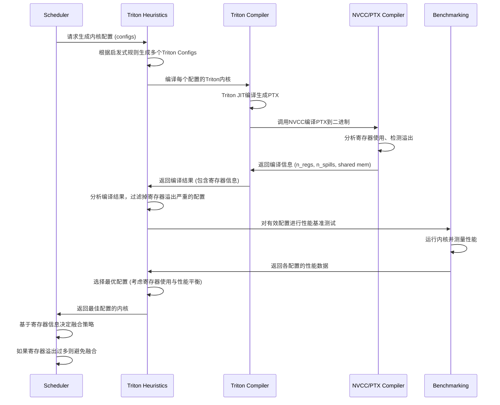

# Triton编译器和scheduler寄存器分析与优化流程

```mermaid
sequenceDiagram
    participant S as Scheduler
    participant TH as Triton Heuristics
    participant TC as Triton Compiler
    participant NVCC as NVCC/PTX Compiler
    participant BM as Benchmarking
    
    S->>TH: 请求生成内核配置 (configs)
    TH->>TH: 根据启发式规则生成多个Triton Configs
    TH->>TC: 编译每个配置的Triton内核
    TC->>TC: Triton JIT编译生成PTX
    TC->>NVCC: 调用NVCC编译PTX到二进制
    NVCC->>NVCC: 分析寄存器使用、检测溢出
    NVCC->>TC: 返回编译信息 (n_regs, n_spills, shared mem)
    TC->>TH: 返回编译结果 (包含寄存器信息)
    TH->>TH: 分析编译结果，过滤掉寄存器溢出严重的配置
    TH->>BM: 对有效配置进行性能基准测试
    BM->>BM: 运行内核并测量性能
    BM->>TH: 返回各配置的性能数据
    TH->>TH: 选择最优配置 (考虑寄存器使用与性能平衡)
    TH->>S: 返回最佳配置的内核
    S->>S: 基于寄存器信息决定融合策略
    S->>S: 如果寄存器溢出过多则避免融合
```